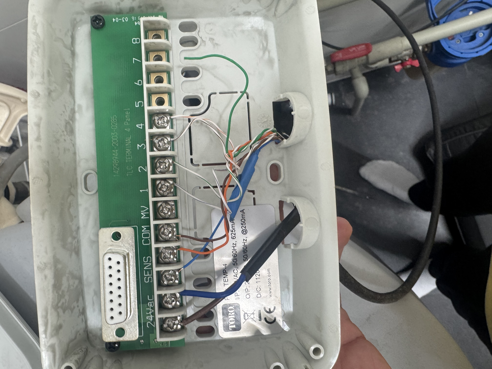
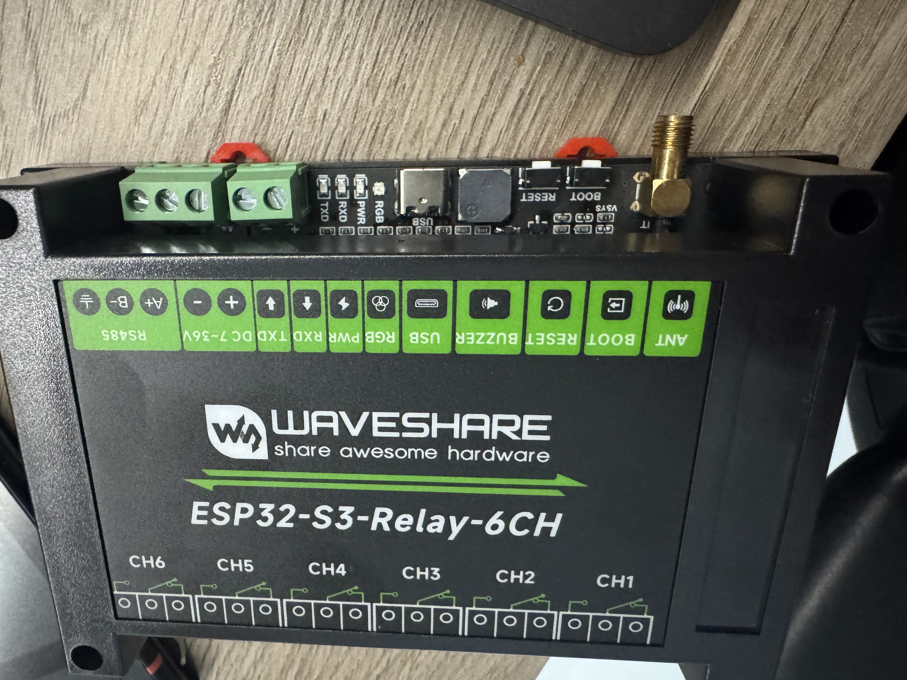

# Garden Irrigation System

System nawadniania ogrodu oparty na ESP32 i Home Assistant, zastepujacy sterownik Toro Temp-4.

## Zdjecia

| Toro Temp-4 (zastepowany) | Waveshare ESP32-S3-Relay-6CH |
|---|---|
|  |  |

## Opis

Projekt zamiany tradycyjnego sterownika nawadniania Toro Temp-4 na rozwiazanie smart home z pelna kontrola przez Home Assistant. Wykorzystuje plytke Waveshare ESP32-S3-Relay-6CH z firmware ESPHome.

## Funkcje

- 4 strefy nawadniania sterowane niezaleznie
- Czujnik deszczu - automatyczne wstrzymanie nawadniania
- Harmonogram nawadniania w Home Assistant
- Reczne sterowanie z poziomu dashboardu HA
- Dioda LED RGB jako wskaznik stanu pracy
- Buzzer do sygnalizacji
- Monitoring WiFi i uptime
- Fallback AP w razie utraty polaczenia z WiFi

## Hardware

| Element | Model |
|---------|-------|
| Kontroler | [Waveshare ESP32-S3-Relay-6CH](https://www.waveshare.com/wiki/ESP32-S3-Relay-6CH) |
| Firmware | [ESPHome](https://esphome.io/) |
| Platforma | [Home Assistant](https://www.home-assistant.io/) |
| Zawory | Istniejace zawory 24V AC z systemu Toro |
| Zasilanie zaworow | Istniejacy transformator 24V AC (Toro) |
| Czujnik deszczu | Styk NO (normally open) |

## Mapowanie kanalow

| Kanal | GPIO   | Funkcja  |
|-------|--------|----------|
| CH1   | GPIO1  | Strefa 1 |
| CH2   | GPIO2  | Strefa 2 |
| CH3   | GPIO41 | Strefa 3 |
| CH4   | GPIO42 | Strefa 4 |
| -     | GPIO4  | Czujnik deszczu |

## Struktura projektu

```
.
├── esphome/
│   ├── irrigation.yaml          # Konfiguracja ESPHome
│   └── secrets.yaml.example     # Szablon plikow secrets
├── homeassistant/
│   └── automations/
│       ├── irrigation_rain_guard.yaml   # Automatyka - ochrona przed deszczem
│       └── irrigation_schedule.yaml     # Automatyka - harmonogram nawadniania
├── docs/
│   ├── hardware.md              # Specyfikacja techniczna
│   └── wiring.md                # Schemat podlaczenia
└── images/
    └── ...                      # Zdjecia sprzetu
```

## Instalacja

### 1. ESPHome

```bash
# Skopiuj secrets
cp esphome/secrets.yaml.example esphome/secrets.yaml

# Uzupelnij dane WiFi i klucze w secrets.yaml

# Flash firmware
esphome run esphome/irrigation.yaml
```

### 2. Home Assistant

1. ESPHome automatycznie wykryje urzadzenie w HA (ESPHome integration)
2. Skopiuj automatyzacje z `homeassistant/automations/` do swojej konfiguracji HA
3. Dostosuj harmonogram nawadniania w `irrigation_schedule.yaml`

### 3. Podlaczenie fizyczne

Szczegolowy schemat: [docs/wiring.md](docs/wiring.md)

Skrotowo:
- Zawory 24V AC podlacz do przekaznikow CH1-CH4 (COM + NO)
- Przewod wspolny zaworow do jednej fazy transformatora 24V AC
- Czujnik deszczu do GPIO4 + GND
- Zasilanie ESP32: 12-24V DC do zlacza srubowego

## Konfiguracja harmonogramu

Domyslny harmonogram (`irrigation_schedule.yaml`):
- Codziennie o 6:00
- Kazda strefa po 15 minut, sekwencyjnie
- Automatyczne pominiecie gdy pada deszcz

Mozesz dostosowac czasy i kolejnosc stref wedlug potrzeb.

## Licencja

MIT
